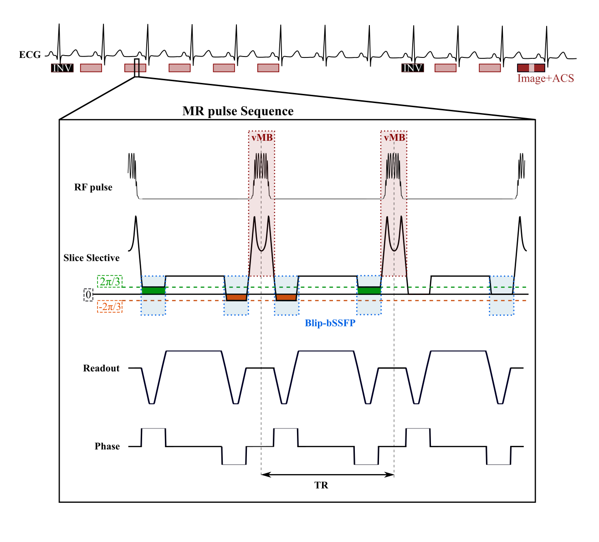

#   <div align="center">  Open-MOLLI-SMS </div>
##  <div align="center"> Open-Source Myocardial T1 mapping accelerated with SMS: combining an auto-calibrated blip-bSSFP readout


<div align="justify"> Quantitative MR methods require reproducibility studies to evaluate their accuracy and precision which can be difficult when MR sequences can vary between centers and scanners. In addition, faster prototyping for concept testing and improvement is challenging and time consuming.</div>

<br/>

This package offers an open-source Simultaneous-Slice Prototype of Myocardial T1 mapping (Open-MOLLI-SMS) using Pulseq [[1,2]](#references) which includes an inversion recovery T1 mapping sequence with a triggering scheme. 

The Open-MOLLI-SMS3 sequence is an inversion recovery acquisition synchronized with the Electrogcardiogram (ECG) using a scheme 5(3)3 (i.e. one inversion (INV) followed by 5 images each acquired in a different RR; 3 RR intervals for longitudinal magnetization recovery; a second inversion followed by 3 images each at a different RR). The MR pulse sequence for three phase encoding lines of the single shot image is shown in detail. The VERSE MB RF pulse [[3]](#references) is displayed within the red box: the SB RF pulse was optimized to include VERSE followed by MB modulation (vMB). This is applied in combination with blipped-bSSFP (in blue) [[4]](#references) where each line with have a different phase according to the blip added to the slice refocusing gradient: 2π/3 (green), -2π/3 (orange),0 (black). The last readout includes the acquisition of additional lines to obtain the calibration information (ACS) [[5]](#references).


<p align="center">

</p>

Open-MOLLI-SMS accessibility allows faster implementation of new ideas, while its applicability to different vendors though Pulseq versatility makes it an easier route for reproducibility studies. 

<br/>

If you use the sequence Open-MOLLI-SMS in your work, cite as:

```
Andreia S Gaspar, Nuno A Silva, Rita G Nunes. Open-Source Myocardial T1 mapping accelerated with SMS: combining an auto-calibrated blip-bSSFP readout with VERSE-MB pulses” Proc. of Annual Meeting ISMRM 2022, London, 2022.
```

## Packages
Open-MOLLI-SMS can be build with Matlab: 
*  **SOpen-MOLLI-SMS**: 
	* **Open-MOLLI-SMS_af1**  can be build from code in Open-MOLLI-SMS_af1 folder. Files in VERSE_RFpulse, bSSFP_readout and bSSFP_ACS folder should be added. 
	* **Open-MOLLI-SMS_af2**  can be build from code in Open-MOLLI-SMS_af2 folder. Files in VERSE_RFpulse,bSSFP_readout, bSSFP_ACS and FLASH_ACS folder should be added. 


## Requirements
In order to create a `Open-MOLLI-SMS.seq` file you will need: 
*  **PULSEQ**:  **Pulseq** package available at: https://github.com/pulseq/pulseq or for python: https://github.com/imr-framework/pypulseq 
*  **Inversion Pulse**: According with  https://github.com/asgaspar/openmolli, files in mr+ folder should be added Pulseq mr+ folder. 
*   **VERSE Optimization**:  
	* **VERSE** [[3]](#references)  package available at: https://github.com/mriphysics/verse-mb


## References
1. Layton KJ, Kroboth S, Jia F, Littin S, Yu H, Leupold J, Nielsen JF, Stöcker T and Zaitsev M. Pulseq: A rapid and hardware‐independent pulse sequence prototyping framework. Magn Reson Med. 2017;77:1544-1552. https://doi.org/10.1002/mrm.26235
2. Keerthi R, Geethanath S, and Vaughan J. PyPulseq: A Python Package for MRI Pulse Sequence Design. Journal of Open Source Software. 2019;4(42): 1725. https://doi.org/10.21105/joss.01725
3. Abo Seada S, Price AN, Schneider T, Hajnal JV, Malik SJ. Multiband RF pulse design for realistic gradient performance. Magn Reson Med. 2019;81(1):362-376.
4. Price AN, Cordero-Grande L, Malik SJ, Hajnal JV. Simultaneous multislice imaging of the heart using multiband balanced SSFP with blipped-CAIPI. Magn Reson Med. 2020;83(6):2185-2196.
5. Ferrazzi G, Bassenge JP, Wink C, et al. Autocalibrated multiband CAIPIRINHA with through-time encoding: Proof of principle and application to cardiac tissue phase mapping. Magn Reson Med. 2019;81(2):1016-1030.
