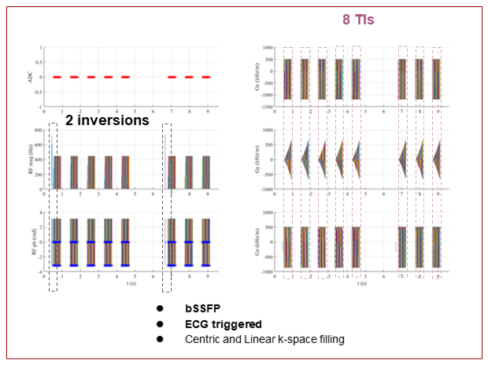

#   <div align="center">  ProMyoT1 </div>
##  <div align="center"> Open-source Inversion recovery myocardial T1 mapping sequence

<div align="justify"> Quantitative MR methods require reproducibility studies to evaluate their accuracy and precision which can be difficult when MR sequences can vary between centers and scanners. In addition, faster prototyping for concept testing and improvement is challenging and time consuming.</div>

<br/>

This package offers an open-source Prototype of Myocardial T1 mapping (ProMyoT1) using Pulseq [[1,2]](#references) which includes an inversion recovery T1 mapping sequence with a triggering scheme. ProMyoT1 accessibility allows faster implementation of new ideas, while its applicability to different vendors though Pulseq versatility makes it an easier route for reproducibility studies. 


<p align="center">

</p>

<br/>

If you use the sequence ProMyoT1 in your work, cite as:

```
Andreia S Gaspar, Nuno A Silva, Rita G Nunes. "ProMyoT1: Open-source Inversion recovery myocardial T1 mapping sequence for fast prototyping” Proc. of Annual Meeting ISMRM 2021, Virtual Meeting, 2021.
```

## Packages
ProMyoT1 can be build with Matlab or Python: 
*  **Matlab**: 
	* **ProMyoT1**  can be build from code in Matlab_ProMyoT1 folder. Files in mr+ folder should be added Pulseq mr+ folder. 
* **Python**:  
	* **PyProMyoT1** can be build from code in Python_pyProMyoT1 folder. This requires pypulseq [[2]](#references) . 
	* A tutorial notebook for pyProMyoT1 is available at [](https://colab.research.google.com/github/ANG13/ProMyoT1/blob/main/PyProMyoT1_Python/pyProMyoT1.ipynb)


## Requirements
In order to create a `ProMyoT1.seq` file you will need: 
*  **Matlab**:  **Pulseq** package available at: https://github.com/pulseq/pulseq
*   **Python**:  
	* **pyPulseq** [[2]](#references)  package available at: https://github.com/imr-framework/pypulseq 
	* You can also install with `pip install pypulseq`


## References
1. Layton KJ, Kroboth S, Jia F, Littin S, Yu H, Leupold J, Nielsen JF, Stöcker T and Zaitsev M. Pulseq: A rapid and hardware‐independent pulse sequence prototyping framework. Magn Reson Med. 2017;77:1544-1552. https://doi.org/10.1002/mrm.26235
2. Keerthi R, Geethanath S, and Vaughan J. PyPulseq: A Python Package for MRI Pulse Sequence Design. Journal of Open Source Software. 2019;4(42): 1725. https://doi.org/10.21105/joss.01725
